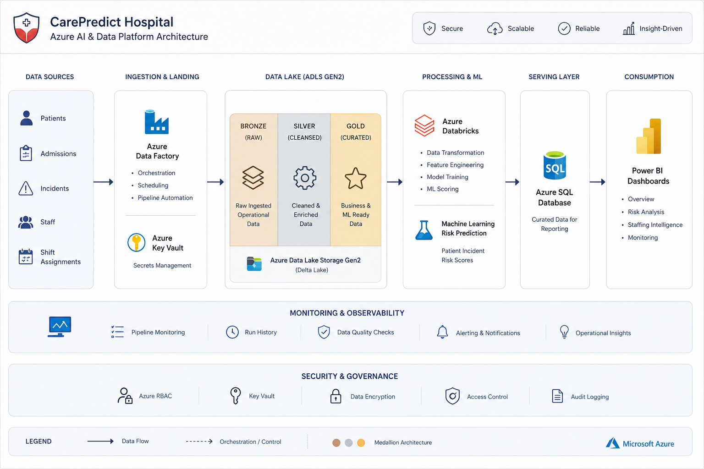
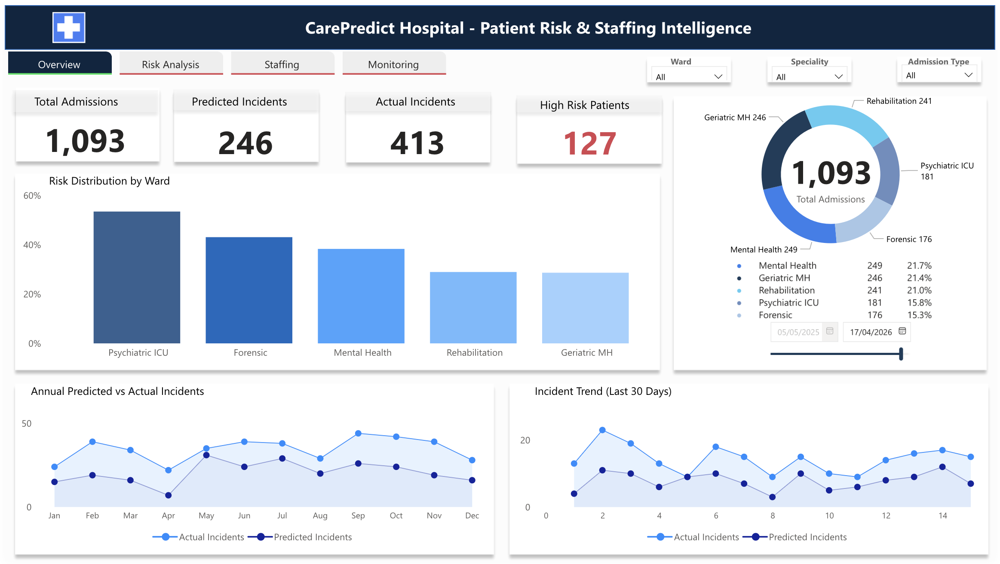
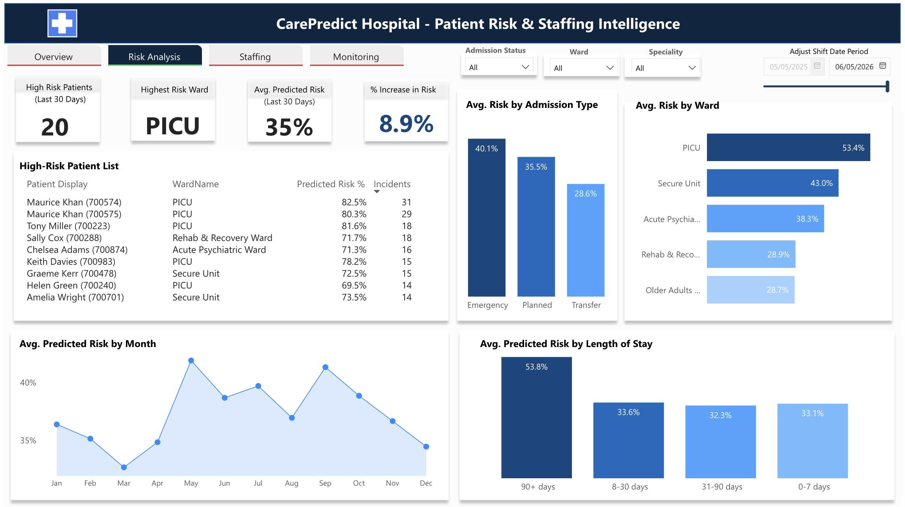
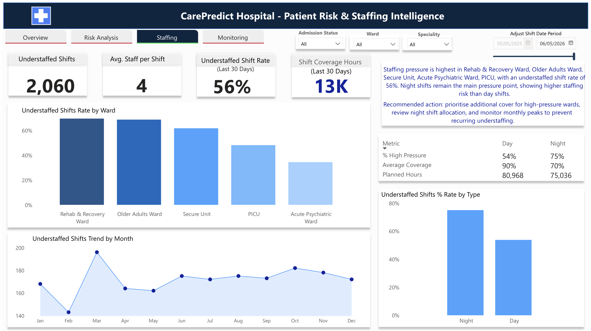
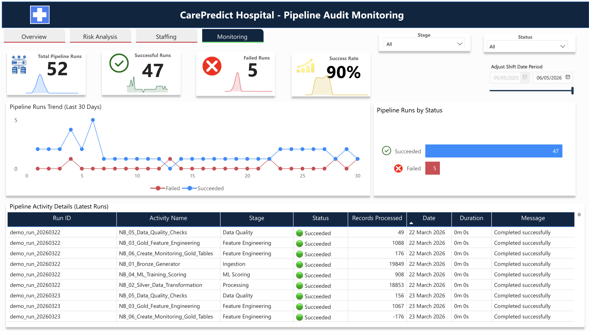

# CarePredict Hospital — Azure AI & Data Platform


# Overview

CarePredict Hospital is a production-style Azure-native healthcare AI and data platform designed to demonstrate how modern cloud data engineering, machine learning, monitoring, and business intelligence can support operational decision-making within a healthcare environment.

The platform ingests simulated hospital operational datasets, processes them through a Medallion Lakehouse architecture using Azure Data Lake Storage Gen2 and Azure Databricks, applies validation and transformation workflows, generates patient incident risk predictions using machine learning, stores curated serving datasets in Azure SQL Database, and surfaces operational insights through interactive Power BI dashboards.

This project demonstrates enterprise-style architecture covering:

* Azure cloud engineering
* Medallion Lakehouse design
* Distributed Spark processing
* Machine learning workflows
* DataOps and monitoring
* Pipeline orchestration
* Executive analytics reporting
* Cloud governance and security

---

# Solution Architecture



---

# Business Problem

Healthcare operational teams often rely on fragmented systems, delayed reporting, and reactive operational processes. Critical insights such as patient risk escalation, staffing pressure, incident monitoring, and pipeline health can become difficult to manage when operational data is distributed across disconnected workflows.

This platform was designed to simulate how a unified Azure-native healthcare intelligence solution can centralise operational analytics, automate data processing, support predictive insights, and improve operational visibility.

---

# Key Features

* Azure-native Medallion Lakehouse architecture
* Automated Azure Data Factory orchestration
* Distributed PySpark transformations in Databricks
* Machine learning patient risk prediction
* Staffing pressure intelligence analytics
* Pipeline monitoring and observability
* Azure SQL serving layer for reporting
* Executive Power BI dashboards
* Validation-driven processing workflows
* Historical monitoring and trend analysis

---

# End-to-End Data Flow

```text
Synthetic Healthcare Operational Data
                ↓
Azure Data Lake Storage Gen2 (Bronze)
                ↓
Azure Databricks Transformations (Silver)
                ↓
Gold Feature Engineering Layer
                ↓
Machine Learning Risk Scoring
                ↓
Azure SQL Database Serving Layer
                ↓
Power BI Dashboards & Operational Reporting
```

---

# Azure Services Used

| Service                      | Purpose                                         |
| ---------------------------- | ----------------------------------------------- |
| Azure Data Lake Storage Gen2 | Bronze, Silver, and Gold Lakehouse storage      |
| Azure Databricks             | Spark processing, transformations, ML workflows |
| Azure Data Factory           | Pipeline orchestration and automation           |
| Azure SQL Database           | Curated serving layer for reporting             |
| Azure Key Vault              | Secure secret and credential management         |
| Power BI Desktop & Service   | Reporting and operational dashboards            |

---

# Medallion Architecture

## Bronze Layer

Stores raw operational healthcare datasets with minimal transformation.

### Example Datasets

* Patients
* Admissions
* Incidents
* Staff
* Shift Assignments

---

## Silver Layer

Cleanses, validates, standardises, and enriches operational datasets.

### Example Processes

* Data quality validation
* Relationship enrichment
* Standardised schemas
* Feature preparation

---

## Gold Layer

Business-ready and ML-ready datasets optimised for analytics and reporting.

### Example Outputs

* Patient safety facts
* Risk prediction outputs
* Staffing intelligence metrics
* Monitoring tables

---

# Machine Learning Workflow

The machine learning workflow predicts patient incident risk using engineered healthcare operational features derived from admissions, staffing activity, incident history, ward allocation, and patient operational patterns.

## ML Workflow Stages

1. Feature Engineering
2. ML Model Training
3. Risk Scoring
4. Prediction Output Generation
5. Dashboard Integration

## Technologies Used

* PySpark MLlib
* Logistic Regression
* Spark DataFrames
* Delta Lake

---

# DataOps & Monitoring

The platform includes a monitoring and validation framework designed to improve operational reliability and observability across orchestration and processing workflows.

## Monitoring Features

* Pipeline run tracking
* Success and failure monitoring
* Records processed metrics
* Execution duration tracking
* Historical pipeline visibility
* Validation checks
* Monitoring dashboards

Although full Azure DevOps CI/CD deployment pipelines were restricted due to permission limitations, the platform was intentionally designed with CI/CD readiness principles through modular notebook architecture, automated orchestration, monitoring-driven workflows, and validation-based processing.

---

# Power BI Dashboard Suite

---

## 1. Overview Dashboard

Provides executive-level operational visibility into:

* Total admissions
* Predicted vs actual incidents
* High-risk patients
* Incident trends
* Ward-level risk distribution



---

## 2. Risk Analysis Dashboard

ML-driven patient risk intelligence dashboard covering:

* High-risk patient identification
* Risk by ward
* Risk by admission type
* Predicted risk trends
* Risk by length of stay



---

## 3. Staffing Intelligence Dashboard

Operational staffing and workforce analysis including:

* Understaffed shifts
* Staffing pressure trends
* Shift coverage analysis
* Day vs night staffing comparison



---

## 4. Monitoring Dashboard

Operational observability dashboard showing:

* Pipeline runs
* Success/failure rates
* Monitoring history
* Records processed
* Execution duration



---

# Repository Structure

```text
carepredict-hospital-ai-platform/
│
├── architecture/
├── dashboards/
├── docs/
├── notebooks/
├── pipelines/
├── README.md
```

---

# Documentation

Detailed project documentation is available inside the `/docs` directory.

## Included Documentation

* Vision & Success Criteria
* Architecture & Security
* Data Model & Contracts
* MLOps & CI/CD
* Power BI Product
* Project Delivery Timeline

---

# Security & Governance

The platform incorporates cloud governance and security principles through:

* Azure Key Vault integration
* Secure secret handling
* Structured Medallion architecture
* Validation-driven workflows
* Historical monitoring retention
* Controlled serving-layer access

No real patient information is used in this project. All healthcare datasets are synthetic and generated for demonstration purposes only.

---


# Key Outcomes

* Built a production-style Azure healthcare analytics platform
* Implemented Medallion Lakehouse architecture
* Automated orchestration using Azure Data Factory
* Developed scalable PySpark transformations
* Integrated machine learning prediction workflows
* Implemented monitoring and observability
* Built executive Power BI dashboards
* Applied DataOps and CI/CD readiness principles
* Structured enterprise-style technical documentation

---

# Author

Toluwani Adefisoye
AI/Data Platform Data Engineer | Analytics Engineer | Senior Power BI Developer |

LinkedIn: [Add Link]
GitHub: [Add Link]

---
